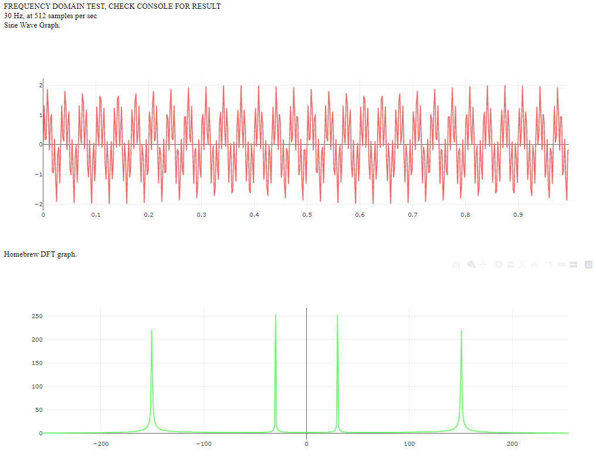

# jsfft-gpu
 Trying to translate jsfft for gpujs, it's confusing. Working very simplistic DFT example using series notation, plus a hacky but ultra fast FFT compared to jsfft, just increase the seconds of simulated data to show how the GPU performance stays fairly stable while CPU time skyrockets for the DFT example, but there are a lot of optimizations possible I will be trying. Check the console for timer results.




CPU simple DFT code
```
console.time("simpledft");
var real = [];
var imag = [];
var mags = [];
var TWOPI = 2*3.141592653589793
for(var k=0; k<sineWave.length;k++){
    real.push(0);
    imag.push(0);
    for(var j=0;j<sineWave.length;j++){
        var shared = TWOPI*k*j/sineWave.length
        real[k] = real[k]+sineWave[j]*Math.cos(shared);
        imag[k] = imag[k]-sineWave[j]*Math.sin(shared);
    }
    mags.push(Math.sqrt(real[k]*real[k]+imag[k]*imag[k]));
}
//console.log(mags);
console.timeEnd("simpledft");
```

GPUJS simple DFT code
```
//in head: <script src=gpu-browser.min.js charset="UTF-8"></script>
var gpu = new GPU();
gpu.addFunction(function DFT(signal,len,freq){ //Extract a particular frequency
var real = 0;
var imag = 0;
for(var i = 0; i<len; i++){
  var shared = 6.28318530718*freq*i/len; //this.thread.x is the target frequency
  real = real+signal[i]*Math.cos(shared);
  imag = imag-signal[i]*Math.sin(shared);
}
//var mag = Math.sqrt(real[k]*real[k]+imag[k]*imag[k]);
return [real,imag]; //mag(real,imag)
});

//Return frequency domain based on DFT
var dft = gpu.createKernel(function (signal,len){
  var result = DFT(signal,len,this.thread.x);
  return mag(result[0],result[1]);
})
.setDynamicOutput(true)
.setDynamicArguments(true);
      
console.time("gpuDFT");
dft.setOutput([sineWave.length]);
dft.setLoopMaxIterations(sineWave.length);
var gpuresult = dft(sineWave,sineWave.length);
console.timeEnd("gpuDFT");

//Order the magnitudes by frequency
var orderedMags = [...gpuresult.slice(Math.ceil(gpuresult.length/2),gpuresult.length),...gpuresult.slice(0,Math.ceil(gpuresult.length/2))];
       
```
more code in the code where the code is
           
